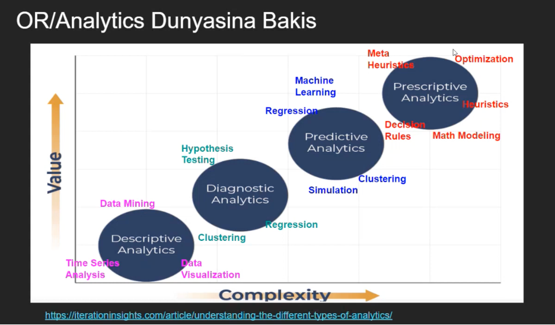

Bu çalışmadaki görevlerimiz;

a.Aşağıdaki kaynaklardan bir video seçmek ve Quarto dokümanımızda kısa bir özetini sunmak:

• Veri Bilimi ve Endüstri Mühendisliği Üzerine Sohbetler - Kerem Demirtaş & Erdi Dasdemir

• Veri Bilimi ve Endüstri Mühendisliği Üzerine Sohbetler - Cem Vardar & Erdi Dasdemir

• Veri Bilimi ve Endüstri Mühendisliği Üzerine Sohbetler - Mustafa Baydoğan & ErdiDaşdemir

• Veri Bilimi ve Endüstri Mühendisliği Üzerine Sohbetler - Baykal Hafızoğlu & Erdi Daşdemir

b\. Seçtiğimiz videodan, cevaplarıyla birlikte bir açık uçlu soru ve bir çoktan seçmeli soru hazırlamak.

Ben Baykal Hafızoğlu'nun konuk olarak katıldığı videoyu seçtim.

Videoya dair özeti, açık uçlu ve çoktan seçmeli sorularımı aşağıda bulabilirsiniz.

## a)Özet

Seçmiş olduğum Veri Bilimi ve Endüstri Mühendisliği Üzerine Sohbetler - Baykal Hafızoğlu & Erdi Daşdemir başlıklı videoda Baykal Hafızoğlu, akademik ve profesyonel kariyer deneyimlerini paylaşarak operasyon araştırması (Operations Research – OR) ve analitik yöntemlerin iş dünyasındaki kullanımı hakkında bilgi paylaşıyor. ODTÜ’de lisans ve yüksek lisans eğitimini tamamladıktan sonra Arizona State University’de doktora yapan Baykal Bey, kısa bir akademik kariyerin ardından ABD’de iş hayatına başlayarak özellikle supply chain alanında analitik model ve çözümler geliştirmiş.

Analitik yaklaşımlar descriptive, diagnostic, predictive ve prescriptive olmak üzere dört ana başlığa ayrılarak anlatılmış ve bu başlıklar value-complexity ekseninde karşılaştırılarak detayları verilmiş. Ayrıca analitik çözüm yöntemlerinin gelişim süreci, kullanım sıklıkları ve çözümün müşteriye nasıl sunulduğu gibi konulara da değinilmiş.

Baykal Bey başarılı projelerin temelinde doğru problem tanımının yer aldığını vurguluyor. En iyi çözüm modelinin en pahalı veya en karmaşık olan değil; en uygulanabilir, basit ve anlaşılır çözüm modeli olduğundan bahsediyor. Bu noktada; müşteri ihtiyaçlarını doğru anlamanın ve müşteri memnuniyetini merkeze almanın da ne kadar önemli olduğunun altını çiziyor. Özellikle tedarik zinciri alanında bir problemin nasıl tanımlanacağı, çözümün nasıl geliştirileceği ve sürecin nasıl yönetileceği hakkında önemli tecrübeler aktarıyor.

Genel olarak videoda analitik çalışmaların amacı, karmaşık görünen problemleri mümkün olduğunca basit, uygulanabilir ve pratik çözümlerle ele almak olarak özetleniyor.

## (b)Çoktan Seçmeli ve Açık Uçlu Soru Önerisi

1.  **Çoktan Seçmeli Soru:**

    Analitik yaklaşımlar veri analizi olgunluk seviyesine göre farklı kategorilere ayrılmaktadır. Aşağıdaki seçeneklerden hangisi bu analitik yaklaşımların **artan analitik olgunluk ve karmaşıklık seviyesine göre doğru sıralamasını** göstermektedir?

    I. Descriptive Analytics

    II\. Diagnostic Analytics

    III\. Predictive Analytics

    IV\. Prescriptive Analytics

    A. I → II → III → IV

    B. I → III → II → IV

    C. II → I → III → IV

    D. I → II → IV → III

    <details>

    <summary><b>Cevabı Gör</b></summary>

    **Doğru cevap:**\
    A Şıkkı: I → II → III → IV

    Açıklama: Analitik yaklaşımlar karmaşıklık ve değer üretme seviyesine göre descriptive → diagnostic → predictive → prescriptive şeklinde ilerler. Bu sıralama analitik olgunluk seviyesinin artışını gösterir.

    {width="512"}

    </details>

2.  **Açık Uçlu Soru**\

    Analitik projelerde başarının yalnızca gelişmiş algoritmalar veya karmaşık modeller kullanmakla ilgili olmadığı bilinmektedir. Buna göre başarılı bir analitik projenin temel özellikleri nelerdir? Kısaca açıklayınız.

    <details>

    <summary><b>Cevabı Gör</b></summary>

    **Doğru cevap:**

    Başarılı bir analitik projenin temelinde doğru problem tanımı ve uygulanabilirlik yer almaktadır. Projenin amacı en karmaşık veya en pahalı modeli geliştirmek değil, gerçek problemi çözen ve uygulanabilir bir çözüm üretmektir. Bu nedenle analitik projelerde müşteri ihtiyaçlarını doğru anlamak, problemi net bir şekilde tanımlamak ve pratik çözümler geliştirmek büyük önem taşır. Ayrıca proje sürecinde paydaşlarla etkin iletişim kurulması ve müşteri memnuniyetinin sağlanması da başarının önemli unsurlarındandır.

    </details>

## (c)Veri Seti

• dslabs paketinden polls_us_election_2016 veri setinin içe aktarılması.

```{r}
library(dslabs)

data("polls_us_election_2016")

data <- polls_us_election_2016

head(data)
```

• İki değişken(Ad ve doğum yılı) ve bir k tamsayısı (integer) tanımlanması. Orijinal veri setinin k adet satırını görüntülemek.

```{r}
my_first <- "Baran"
my_birth_year <- 1997
k <- (nchar(my_first) + my_birth_year) %% 15 + 8
if (k %% 2 == 0) {
  head(data, k)
} else {
  tail(data, k)
}
```

• Tüm veri setindeki toplam NA (eksik) değer sayısı.

```{r}
sum(is.na(data))
```

• En büyükten en küçüğe sıralanmış şekilde sütun başına NA değer sayısı (ilk 8 sütunu görüntülemek.)

```{r}
library(knitr)

na_counts <- colSums(is.na(data))
na_counts_sorted <- sort(na_counts, decreasing = TRUE)

kable(head(na_counts_sorted, 8))
```

•Veri setindeki tüm NA değerlerini aşağıdaki gibi değiştirin ve sonucu yeni bir nesne olarak kaydedin (orijinalin üzerine yazmayın):

– Sayısal (numeric) sütunlar için: NA değerlerini my_birth_year + k ile değiştirin.

– Karakter (character) veya faktör (factor) sütunları için: NA değerlerini paste0(my_first, "\_", k) ile değiştirin.

```{r}
new_data <- data

for (col in names(new_data)) {
  
  if (is.numeric(new_data[[col]])) {
    
    new_data[[col]][is.na(new_data[[col]])] <- my_birth_year + k
    
  } else if (is.character(new_data[[col]])) {
    
    new_data[[col]][is.na(new_data[[col]])] <- paste0(my_first, "_", k)
    
  } else if (is.factor(new_data[[col]])) {
    
    new_data[[col]] <- as.character(new_data[[col]])
    new_data[[col]][is.na(new_data[[col]])] <- paste0(my_first, "_", k)
    
  }
}
```

• Yeni veri çerçevesi (data frame) için çıktıları yazdırın:

1\. Yukarıdakiyle tamamen aynı kuralı kullanarak yeni veri çerçevesinin k satırını görüntüleyin:

– Eğer k çift ise, yeni veri çerçevesinin ilk k satırını gösterin.

– Eğer k tek ise, yeni veri çerçevesinin son k satırını gösterin.

2\. Yeni veri çerçevesinde kalan toplam NA değer sayısını görüntüleyin.

3\. Ayrıca anyNA(new_data) komutunu da yazdırın (Eğer doğru bir şekilde değiştirdiyseniz FALSE döndürmelidir).

```{r}
# 1. k’ya göre satır gösterme
if (k %% 2 == 0) {
  head(new_data, k)
} else {
  tail(new_data, k)
}

# 2. Toplam NA sayısı
sum(is.na(new_data))

# 3. anyNA sonucu
anyNA(new_data)
```
