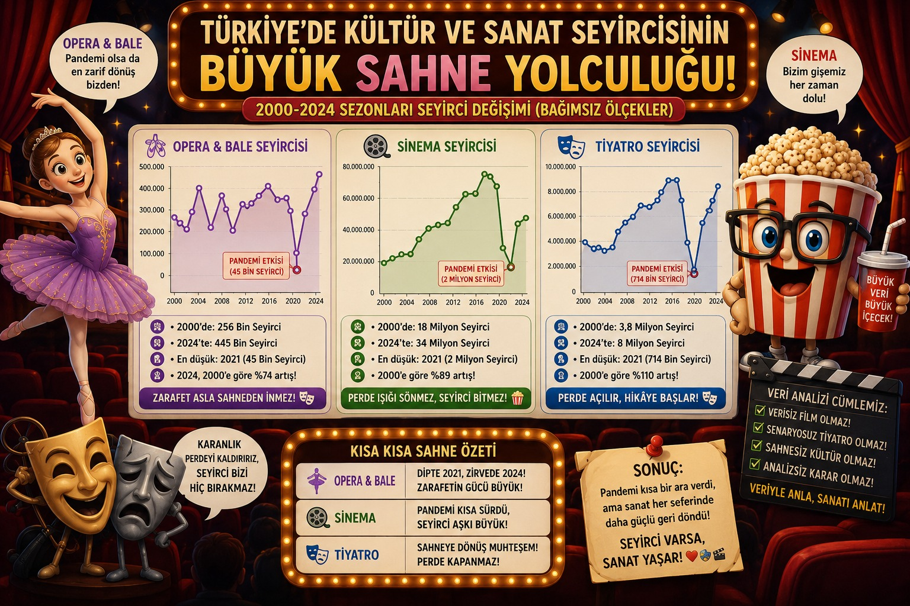

{fig-align="center" width="1000" height="600"}

```{r ilgili kütüphanelerin çağrılması, message=FALSE, warning=FALSE, echo=FALSE}
library(readxl)
library(tidyverse)
library(knitr)
library(DT)
library(ggtext)
library(ggrepel)
library(ggh4x)
library(scales)
library(zoo)
library(tsibble)
library(gt)
library(dplyr)
library(psych)
```

# 👥 FOUR CORNERS 👥

[👩‍💻]{style="font-size:20px;"} [Ceren Aşkit](takim/cerenaskit.qmd){.download-button}

[👩‍💻]{style="font-size:20px;"}[Pakize Hergül Kaya](takim/pakizehergulkaya.qmd){.download-button}

[👩‍💻]{style="font-size:20px;"}[Esin Gül](takim/esingul.qmd){.download-button}

[👨‍💻]{style="font-size:20px;"} [Baran Balcı](takim/baranbalci.qmd){.download-button}

# Proje Genel Bakış ve Kapsamı

Bu çalışma, Türkiye'de 2000-2024 yılları arasında kültürel tüketimin nasıl dönüştüğünü anlamayı amaçlamaktadır. Tiyatro, sinema ile opera ve bale sektörlerine ait seyirci verileri; nüfus büyümesi ve hanehalkı harcama yapısındaki değişimlerle birlikte ele alınarak kültürel talebi şekillendiren dinamikler çok boyutlu biçimde incelenmektedir. Projenin kapsamı iki temel eksen üzerine kuruludur. İlk eksende, sektörel seyirci trendleri zaman serisi analiziyle ortaya konmakta; pandemi ve ekonomik dalgalanmalar gibi dışsal şokların her sektörü nasıl farklı etkilediği değerlendirilmektedir. İkinci eksende ise artan nüfusun ve değişen hanehalkı bütçe önceliklerinin kültürel harcamalar üzerindeki etkisi regresyon modelleriyle analiz edilmektedir. Tüm analizler TÜİK'in kamuya açık veri setleri kullanılarak R programlama diliyle gerçekleştirilmiş; bulgular görselleştirme ağırlıklı bir yaklaşımla sunulmuştur.

# Veri

Türkiye’nin son çeyrek asırdaki sosyo-ekonomik dönüşümünü, kültürel tüketim eğilimlerini ve dijitalleşme hızını arz-talep dengesi çerçevesinde ortaya koyan çok boyutlu bir görünüm sunmaktadır. Cinsiyete Göre Nüfus ve Hanehalkı Tüketim Harcaması verileri, toplumsal yapının demografik büyümesini ve ekonomik refah seviyesine bağlı olarak eğlence-kültüre ayrılan bütçe payını gösteren temel makro göstergelerdir. Tiyatro, Sinema ile Opera ve Bale veri setleri ise salon, koltuk ve eser sayılarıyla kültürel altyapının (arzın) genişlemesini; seyirci sayılarıyla da bu sanatsal faaliyetlere olan toplumsal talebin boyutu ile kırılma noktalarını (pandemi, ekonomik dalgalanmalar vb.) temsil etmektedir. Son olarak, Cinsiyete Göre İnternet Kullanım Oranı serisi, hızla yükselen dijitalleşme trendinin, bireylerin ev dışı fiziksel etkinliklere (tiyatro, opera) katılım alışkanlıkları veya dijital platformlara (sinema alternatifi olarak) yönelimleri üzerindeki dönüştürücü etkisini analiz etmeye olanak tanımaktadır.

# Veri Kaynağı

```{r, echo=FALSE}
veri_kaynak_tablosu <- data.frame(
  Sıra = 1:5,
  
  Veri_Seti = c(
    "Sezon Yılına Göre Tiyatro Salonu, Oynanan Eser ve Seyirci Sayısı",
    "Opera ve Bale Salonu, Koltuk, Oynanan Eser ve Seyirci Sayısı",
    "Sinema Gösterilen Film ve Seyirci Sayısı",
    "Hanehalkı Tüketim Harcamasının Türlerine Göre Dağılımı",
    "Cinsiyete Göre Nüfus"
  ),
  
  Kaynak = c(
    rep("TÜİK (Kültür İstatistikleri)", times = 3), # İlk 3 satır aynı olduğu için rep() kullandık
    "TÜİK (Gelir ve Yaşam Koşulları)",
    "TÜİK (ADNKS / Nüfus Projeksiyonları)"
  ),
  
  Veri_Tipi = c(
    "Sayısal (Yıllık/Sezon)",
    "Sayısal (Yıllık)",
    "Sayısal (Yıllık)",
    "Yüzde (%)",
    "Sayısal (Yıllık)"
  ),
  
  Yapısal_Rol = c(
    "Bağımlı Değişken (Analiz Edilen Temel Trend)",
    "Karşılaştırmalı Değişken (Niş Sanat Dalı Trendi)",
    "Karşılaştırmalı Değişken (Kitlesel Eğlence Trendi)",
    "Bağımsız Değişken (Ekonomik Bütçe/Refah Etkisi)",
    "Kontrol Değişkeni (Kişi Başına Oranlama Matrisi)"
  ),
  
  stringsAsFactors = FALSE
)

# Tabloyu görmek için:
knitr::kable(veri_kaynak_tablosu)


```

```{r verinin yüklenmesi, message=FALSE, warning=FALSE, echo=FALSE}
tiyatro_pure <- read_excel("data/SezonYılınaGoreTiyatroSalonuOynananEserveSeyirciSayısı.xlsx")

hanehalkı_tüketim <- read_excel("data/HanehalkıTuketimHarcamasınınTurlerineGoreDagılımı.xlsx")

nüfus <- read_excel("data/CinsiyeteGoreNufus.xlsx")

opera_pure <- read_excel("data/OperaveBaleSalonuKoltukOynananEserveSeyirciSayısı.xlsx")

sinema_pure <- read_excel("data/SinemaGosterilenFilmveSeyirciSayısı.xlsx")

```

# Keşifsel Veri Analizi ve Ön İşleme

Çalışma kapsamında kullanılan TÜİK veri setleri analiz öncesinde ön işleme sürecinden geçirilmiştir. Bu süreçte veri setlerinde bulunan gereksiz satır ve sütunlar temizlenmiş, sütun isimleri düzenlenmiş ve veri tipleri analiz için uygun hale getirilmiştir.

TÜİK’ten dışa aktarılan bazı Excel dosyalarının standart tablo yapısında olmaması nedeniyle veri setlerinde yüksek sayıda NA (eksik değer) oluşmuştur. Yapılan incelemelerde bu eksik değerlerin büyük kısmının veri kaybından değil, Excel dosyalarının yapısal formatından kaynaklandığı görülmüştür.

Eksik verilerin giderilmesi amacıyla farklı yöntemlerden yararlanılmıştır. Bazı eksik değerler önceki yıllardaki verilere göre doldurulmuş, bazı alanlarda doğrusal artış yaklaşımı kullanılmış, ayrıca uygun veri setlerinde interpolasyon yöntemi uygulanmıştır. Böylece analiz ve görselleştirme işlemleri için daha düzenli ve kullanılabilir veri setleri elde edilmiştir.

Ayrıca farklı veri setleri yıllar bazında ortak bir yapıda birleştirilmiş ve analiz süreçlerine uygun veri formatı oluşturulmuştur.

## Veriye Genel Bakış

```{r, echo=FALSE}

# Ham verilerin boyut özeti — tablolar yerine sadece satır/sütun bilgisi
veri_ozeti <- data.frame(
  Veri_Seti = c("Tiyatro", "Opera & Bale", "Sinema", 
                "Hanehalkı Tüketim", "Nüfus"),
  Satır = c(nrow(tiyatro_pure), nrow(opera_pure), nrow(sinema_pure),
            nrow(hanehalkı_tüketim), nrow(nüfus)),
  Sütun = c(ncol(tiyatro_pure), ncol(opera_pure), ncol(sinema_pure),
            ncol(hanehalkı_tüketim), ncol(nüfus))
)
knitr::kable(veri_ozeti, caption = "Ham Veri Setlerinin Boyutları")

```

<details>

<summary><b>Tabloyu Detaylı Görüntülemek İçin Tıklayın</b></summary>

```{r, echo=FALSE}

knitr::kable(tiyatro_pure[1:5, ])
knitr::kable(hanehalkı_tüketim[1:5, ])
knitr::kable(nüfus[1:5, ])
knitr::kable(opera_pure[1:5, ])
knitr::kable(sinema_pure[1:5, ])

```

</details>

## Veride bulunan Sütunlardaki NA Sayısı

```{r, echo=FALSE}
# 6 ayrı tablo yerine tek birleşik özet
na_ozet <- data.frame(
  Veri_Seti = c("Tiyatro", "Opera & Bale", "Sinema",
                "Hanehalkı Tüketim", "Nüfus"),
  Toplam_Sütun_Sayısı = c(ncol(tiyatro_pure), ncol(opera_pure), ncol(sinema_pure),
                   ncol(hanehalkı_tüketim), ncol(nüfus)),
  NA_Iceren_Sütun_Sayısı = c(
    sum(colSums(is.na(tiyatro_pure)) > 0),
    sum(colSums(is.na(opera_pure)) > 0),
    sum(colSums(is.na(sinema_pure)) > 0),
    sum(colSums(is.na(hanehalkı_tüketim)) > 0),
    sum(colSums(is.na(nüfus)) > 0)
  ),
  Toplam_NA_Sayısı = c(
    sum(is.na(tiyatro_pure)), sum(is.na(opera_pure)), sum(is.na(sinema_pure)),
    sum(is.na(hanehalkı_tüketim)), sum(is.na(nüfus))
  )
)
knitr::kable(na_ozet, caption = "Veri Setlerinde Eksik Değer (NA) Özeti")
```

<details>

<summary><b>Tabloyu Detaylı Görüntülemek İçin Tıklayın</b></summary>

```{r, echo=FALSE}

#tiyatro
tiyatro_ozet <- data.frame(
  Sutun_Adi = colnames(tiyatro_pure),
  NA_Sayisi = colSums(is.na(tiyatro_pure))
)
knitr::kable(tiyatro_ozet, caption = "Sütun İsimleri ve Eksik Veri (NA) Sayıları")

#opera
opera_ozet <- data.frame(
  Sutun_Adi = colnames(opera_pure),
  NA_Sayisi = colSums(is.na(opera_pure))
)
knitr::kable(opera_ozet, caption = "Sütun İsimleri ve Eksik Veri (NA) Sayıları")

#sinema
sinema_ozet <- data.frame(
  Sutun_Adi = colnames(sinema_pure),
  NA_Sayisi = colSums(is.na(sinema_pure))
)
knitr::kable(sinema_ozet, caption = "Sütun İsimleri ve Eksik Veri (NA) Sayıları")


#hanehalkı
hanehalkı_ozet <- data.frame(
  Sutun_Adi = colnames(hanehalkı_tüketim),
  NA_Sayisi = colSums(is.na(hanehalkı_tüketim))
)
knitr::kable(hanehalkı_ozet, caption = "Sütun İsimleri ve Eksik Veri (NA) Sayıları")


#nüfus
nüfus_ozet <- data.frame(
  Sutun_Adi = colnames(nüfus),
  NA_Sayisi = colSums(is.na(nüfus))
)
knitr::kable(nüfus_ozet, caption = "Sütun İsimleri ve Eksik Veri (NA) Sayıları")


```

</details>

Veri setlerinde görülen yüksek NA (eksik değer) sayıları, kullanılan TÜİK Excel dosyalarının yapısından kaynaklanmaktadır. TÜİK’ten dışa aktarılan bazı veri tablolarında birden fazla alt tablo aynı Excel sayfasında yer almakta ve başlık/satır yapıları standart veri formatında bulunmamaktadır. Bu nedenle veri ön işleme aşamasında gereksiz satır ve sütunlar temizlenmiş, analiz için uygun veri yapısı oluşturulmuştur. Tespit edilen NA değerlerinin önemli bir kısmı veri eksikliğinden değil, veri setinin yapısal formatından kaynaklanmaktadır.

## Verilerin Özet İstatiksel Değer Tabloları

```{r tiyatro verisinde kullanılacak sütunların ayrıştırılması, message=FALSE, warning=FALSE, echo=FALSE}

tiyatro_clean <- tiyatro_pure %>%
  select(
    Sezon = 1, 
    Toplam_Eser = 5, 
    Oyun_Telif = 6, 
    Oyun_Ceviri = 7,
    Toplam_Seyirci = 13, 
    Seyirci_Telif = 14, 
    Seyirci_Ceviri = 15
  ) %>%
  filter(!is.na(Toplam_Seyirci), !is.na(Sezon), !is.na(Toplam_Eser), !is.na(Oyun_Telif), !is.na(Oyun_Ceviri), !is.na(Seyirci_Telif), !is.na(Seyirci_Ceviri) ) %>%
  filter(str_detect(Sezon, "1999|20[0-9]{2}")) %>%
  
  mutate(
    Toplam_Seyirci = as.numeric(str_remove_all(Toplam_Seyirci, "[\\.\\s]")),
    Toplam_Eser    = as.numeric(str_remove_all(Toplam_Eser, "[\\.\\s]")),
    Oyun_Telif     = as.numeric(str_remove_all(Oyun_Telif, "[\\.\\s]")),
    Oyun_Ceviri    = as.numeric(str_remove_all(Oyun_Ceviri, "[\\.\\s]")),
    Seyirci_Telif  = as.numeric(str_remove_all(Seyirci_Telif, "[\\.\\s]")),
    Seyirci_Ceviri = as.numeric(str_remove_all(Seyirci_Ceviri, "[\\.\\s]")),
    
    Yil = 2000:2024
  ) 
```

```{r opera verisinde kullanılacak sütunların ayrıştırılması, message=FALSE, warning=FALSE, echo=FALSE}

opera_clean <- opera_pure %>%
  select(
    Sezon = 1,
    Toplam_Eser = 5, 
    Yerli_Eser = 6,
    Yabancı_Eser = 7,
    Toplam_Seyirci = 9, 
    YerliEser_Seyirci = 10,
    YabancıEser_Seyirci = 11
  ) %>%
  filter(!is.na(Toplam_Seyirci), !is.na(Sezon), !is.na(Toplam_Eser), !is.na(Yerli_Eser), !is.na(Yabancı_Eser), !is.na(YerliEser_Seyirci), !is.na(YabancıEser_Seyirci) ) %>%
  filter(str_detect(Sezon, "1999|20[0-9]{2}")) %>%
  
  mutate(
    Toplam_Seyirci = as.numeric(str_remove_all(Toplam_Seyirci, "[\\.\\s]")),
    Toplam_Eser    = as.numeric(str_remove_all(Toplam_Eser, "[\\.\\s]")),
    Yerli_Eser     = as.numeric(str_remove_all(Yerli_Eser, "[\\.\\s]")),
    Yabancı_Eser    = as.numeric(str_remove_all(Yabancı_Eser, "[\\.\\s]")),
    YerliEser_Seyirci  = as.numeric(str_remove_all(YerliEser_Seyirci, "[\\.\\s]")),
    YabancıEser_Seyirci = as.numeric(str_remove_all(YabancıEser_Seyirci, "[\\.\\s]")),
    
    Yil = 2000:2024
  )

```

```{r sinema verisinde kullanılacak sütunların ayrıştırılması, message=FALSE, warning=FALSE, echo=FALSE}

sinema_clean <- sinema_pure %>%
  select(
    Yil = 1,
    Toplam_Film = 5, 
    Yerli_Film = 6,
    Yabancı_Film = 7,
    Toplam_Seyirci = 9, 
    YerliFilm_Seyirci = 10,
    YabancıFilm_Seyirci = 11
  ) %>%
  filter(!is.na(Toplam_Seyirci), !is.na(Yil),) %>%
  filter(str_detect(Yil, "1999|20[0-9]{2}")) %>%
  
  mutate(
    Toplam_Seyirci = as.numeric(str_remove_all(Toplam_Seyirci, "[\\.\\s]")),
    Toplam_Film    = as.numeric(str_remove_all(Toplam_Film, "[\\.\\s]")),
    Yerli_Film     = as.numeric(str_remove_all(Yerli_Film, "[\\.\\s]")),
    Yabancı_Film    = as.numeric(str_remove_all(Yabancı_Film, "[\\.\\s]")),
    YerliFilm_Seyirci  = as.numeric(str_remove_all(YerliFilm_Seyirci, "[\\.\\s]")),
    YabancıFilm_Seyirci = as.numeric(str_remove_all(YabancıFilm_Seyirci, "[\\.\\s]")),
    
    Yil = 2000:2024
  ) %>%
  filter(Yil >= 2000 & Yil <= 2024) 

# 2. ADIM: 2022 Yılı Çift Verilerinin Ortalamasını Alma
# (Eğer sinema verisinde mükerrer yıl varsa ortalar, yoksa yapıyı bozmadan devam eder)
sinema_ortalanmis <- sinema_clean %>%
  group_by(Yil) %>%
  summarise(across(everything(), mean, na.rm = TRUE), .groups = "drop") %>%
  mutate(across(-Yil, round))  # Film ve seyirci sayılarını tam sayıya yuvarlar

# 3. ADIM: Eksik Yılları Açma ve İnterpolasyon ile Doldurma
# (Bu aşamada seri 2022'de biter, interpolasyon ara yılları doldurur)
sinema_interpolasyon <- sinema_ortalanmis %>%
  complete(Yil = min(Yil):max(Yil)) %>%
  filter(Yil <= 2022)

# 4. ADIM: EKLENEN BIND_ROWS KISMI - 2023 ve 2024 Yıllarını Tablonun Üstüne Ekleme
# Görselde yer alan elinizdeki güncel seyirci sayılarını buraya giriyoruz
gelecek_yillar <- tibble(
  Yil                 = c(2023, 2024),
  Toplam_Film         = c(NA_real_, NA_real_), 
  Yerli_Film          = c(NA_real_, NA_real_),
  Yabancı_Film        = c(NA_real_, NA_real_),
  Toplam_Seyirci      = c(31005844, 32538289),
  YerliFilm_Seyirci   = c(13716005, 18469778),
  YabancıFilm_Seyirci = c(17289839, 14068511)
) 

# Tabloları birleştirip sıralıyoruz ve serinin sonundaki boş film sayılarını tamamlıyoruz
sinema_tamamlanmis <- bind_rows(sinema_interpolasyon, gelecek_yillar) %>%
  arrange(Yil) %>%
  mutate(
    Toplam_Film  = round(na.approx(Toplam_Film, rule = 2)),
    Yerli_Film   = round(na.approx(Yerli_Film, rule = 2)),
    Yabancı_Film = round(na.approx(Yabancı_Film, rule = 2))
  )


```

```{r tiyatro-veri-ozet, echo=FALSE}

tiyatro_clean %>%
  select(-Yil) %>% 
  select(where(is.numeric)) %>%
  psych::describe() %>% 
  as.data.frame() %>%
  select(n, mean, sd, min, median, max) %>%
  gt(rownames_to_stub = TRUE) %>%
  
  # 1. Başlık ve Alt Başlık Tanımlama
  tab_header(
    title = md("**Tiyatro Veri Seti Özet İstatistikleri**"),
    subtitle = "2000-2024 Yılları Arası Genel Dağılım"
  ) %>%
  
  # 2. HATA ÇÖZÜMÜ: Başlık Yazı Renklerini Ayarlama (tab_style ile)
  tab_style(
    style = cell_text(color = "white", weight = "bold"),
    locations = cells_title(groups = "title")
  ) %>%
  tab_style(
    style = cell_text(color = "#ecf0f1"),
    locations = cells_title(groups = "subtitle")
  ) %>%
  
  # 3. Sütun İsimlerini Türkçeleştirme
  cols_label(
    n = "Gözlem (Yıl)",
    mean = "Ortalama",
    sd = "Std. Sapma",
    min = "En Düşük",
    median = "Medyan",
    max = "En Yüksek"
  ) %>%
  
  # 4. Sayı Formatı (Binlik Ayraç Nokta, Ondalık Virgül)
  fmt_number(
    columns = everything(), 
    decimals = 0, 
    use_seps = TRUE, 
    sep_mark = ".", 
    dec_mark = ","
  ) %>%
  
  # 5. Genel Tablo Tasarımı ve Arka Plan Renkleri
  tab_options(
    # Başlık arka plan rengi (Hata veren yazı renkleri buradan kaldırıldı)
    heading.background.color = "#2c3e50",
    
    # Sütun başlıkları alanı
    column_labels.background.color = "#f8f9fa",
    column_labels.font.weight = "bold",
    
    # Satır çizgileri ve zebra deseni
    row.striping.include_table_body = TRUE,
    row.striping.background_color = "#f2f4f4",
    
    # Çizgiler ve genişlik ayarları
    table.border.top.color = "black",
    table.border.bottom.color = "black",
    table_body.hlines.color = "#dddddd",
    
    # Yazı boyutu ve satır ferahlığı
    table.font.size = px(14),
    data_row.padding = px(8)
  ) %>%
  
  # 6. Sağ Hizalama
  cols_align(
    align = "right",
    columns = everything()
  )

```

```{r opera-veri-ozet, echo=FALSE}
opera_clean %>%
  select(-Yil) %>% 
  select(where(is.numeric)) %>%
  psych::describe() %>% 
  as.data.frame() %>%
  select(n, mean, sd, min, median, max) %>%
  gt(rownames_to_stub = TRUE) %>%
  
  # 1. Başlık ve Alt Başlık Tanımlama
  tab_header(
    title = md("**Opera ve Bale Veri Seti Özet İstatistikleri**"),
    subtitle = "2000-2024 Yılları Arası Genel Dağılım"
  ) %>%
  
  # 2. HATA ÇÖZÜMÜ: Başlık Yazı Renklerini Ayarlama (tab_style ile)
  tab_style(
    style = cell_text(color = "white", weight = "bold"),
    locations = cells_title(groups = "title")
  ) %>%
  tab_style(
    style = cell_text(color = "#ecf0f1"),
    locations = cells_title(groups = "subtitle")
  ) %>%
  
  # 3. Sütun İsimlerini Türkçeleştirme
  cols_label(
    n = "Gözlem (Yıl)",
    mean = "Ortalama",
    sd = "Std. Sapma",
    min = "En Düşük",
    median = "Medyan",
    max = "En Yüksek"
  ) %>%
  
  # 4. Sayı Formatı (Binlik Ayraç Nokta, Ondalık Virgül)
  fmt_number(
    columns = everything(), 
    decimals = 0, 
    use_seps = TRUE, 
    sep_mark = ".", 
    dec_mark = ","
  ) %>%
  
  # 5. Genel Tablo Tasarımı ve Arka Plan Renkleri
  tab_options(
    # Başlık arka plan rengi (Hata veren yazı renkleri buradan kaldırıldı)
    heading.background.color = "#2c3e50",
    
    # Sütun başlıkları alanı
    column_labels.background.color = "#f8f9fa",
    column_labels.font.weight = "bold",
    
    # Satır çizgileri ve zebra deseni
    row.striping.include_table_body = TRUE,
    row.striping.background_color = "#f2f4f4",
    
    # Çizgiler ve genişlik ayarları
    table.border.top.color = "black",
    table.border.bottom.color = "black",
    table_body.hlines.color = "#dddddd",
    
    # Yazı boyutu ve satır ferahlığı
    table.font.size = px(14),
    data_row.padding = px(8)
  ) %>%
  
  # 6. Sağ Hizalama
  cols_align(
    align = "right",
    columns = everything()
  )

```

```{r sinema-veri-ozet, echo=FALSE}
sinema_tamamlanmis %>%
  select(-Yil) %>% 
  select(where(is.numeric)) %>%
  psych::describe() %>% 
  as.data.frame() %>%
  select(n, mean, sd, min, median, max) %>%
  gt(rownames_to_stub = TRUE) %>%
  
  # 1. Başlık ve Alt Başlık Tanımlama
  tab_header(
    title = md("**Sinema Veri Seti Özet İstatistikleri**"),
    subtitle = "2000-2024 Yılları Arası Genel Dağılım"
  ) %>%
  
  # 2. HATA ÇÖZÜMÜ: Başlık Yazı Renklerini Ayarlama (tab_style ile)
  tab_style(
    style = cell_text(color = "white", weight = "bold"),
    locations = cells_title(groups = "title")
  ) %>%
  tab_style(
    style = cell_text(color = "#ecf0f1"),
    locations = cells_title(groups = "subtitle")
  ) %>%
  
  # 3. Sütun İsimlerini Türkçeleştirme
  cols_label(
    n = "Gözlem (Yıl)",
    mean = "Ortalama",
    sd = "Std. Sapma",
    min = "En Düşük",
    median = "Medyan",
    max = "En Yüksek"
  ) %>%
  
  # 4. Sayı Formatı (Binlik Ayraç Nokta, Ondalık Virgül)
  fmt_number(
    columns = everything(), 
    decimals = 0, 
    use_seps = TRUE, 
    sep_mark = ".", 
    dec_mark = ","
  ) %>%
  
  # 5. Genel Tablo Tasarımı ve Arka Plan Renkleri
  tab_options(
    # Başlık arka plan rengi (Hata veren yazı renkleri buradan kaldırıldı)
    heading.background.color = "#2c3e50",
    
    # Sütun başlıkları alanı
    column_labels.background.color = "#f8f9fa",
    column_labels.font.weight = "bold",
    
    # Satır çizgileri ve zebra deseni
    row.striping.include_table_body = TRUE,
    row.striping.background_color = "#f2f4f4",
    
    # Çizgiler ve genişlik ayarları
    table.border.top.color = "black",
    table.border.bottom.color = "black",
    table_body.hlines.color = "#dddddd",
    
    # Yazı boyutu ve satır ferahlığı
    table.font.size = px(14),
    data_row.padding = px(8)
  ) %>%
  
  # 6. Sağ Hizalama
  cols_align(
    align = "right",
    columns = everything()
  )

```

```{r hanehalkıtüketim verisinde kullanılacak sütunların ayrıştırılması, message=FALSE, warning=FALSE, echo=FALSE}

hanehalkı_clean <- hanehalkı_tüketim %>%
  select(Yil = 1, Eglence_Kultur_Oran = 12) %>%
  filter(!is.na(Yil), !is.na(Eglence_Kultur_Oran)) %>%
  mutate(
    Yil = as.numeric(str_extract(Yil, "^[0-9]{4}")),
    Eglence_Kultur_Oran = as.numeric(str_replace_all(Eglence_Kultur_Oran, ",", ".")),
    Eglence_Kultur_Oran = round(Eglence_Kultur_Oran, digits = 2)
  ) %>%
  filter(Yil >= 2002 & Yil <= 2024)

# 2. ADIM: EKLENEN KISIM - 2022 Yılı Çift Verilerinin Ortalamasını Alma
# Yıllara göre gruplayarak mükerrer olan 2022'leri tek satıra düşürüyoruz.
hanehalkı_ortalanmis <- hanehalkı_clean %>%
  group_by(Yil) %>%
  summarise(Eglence_Kultur_Oran = mean(Eglence_Kultur_Oran, na.rm = TRUE), .groups = "drop") %>%
  mutate(Eglence_Kultur_Oran = round(Eglence_Kultur_Oran, digits = 2)) # Ortalama sonrası virgülden sonrasını yuvarlıyoruz


# 3. ADIM: EKLENEN KISIM - 2020 ve 2021 Yıllarını Açma ve İnterpolasyon ile Doldurma
hanehalkı_interpolasyon <- hanehalkı_ortalanmis %>%
  complete(Yil = min(Yil):max(Yil)) %>% # 2002 ile 2024 arasındaki tüm yılları (2020-2021 dahil) oluşturur
  mutate(Eglence_Kultur_Oran = na.approx(Eglence_Kultur_Oran, na.rm = FALSE)) %>% # Boşlukları doğrusal doldurur
  mutate(Eglence_Kultur_Oran = round(Eglence_Kultur_Oran, digits = 2)) # Çıkan sonuçları yuvarlıyoruz


# 4. ADIM: Sizin yazdığınız 2000-2001 yıllarını geriye dönük kopyalama mantığı
# (Artık hanehalkı_interpolasyon tablosu üzerinden 2002 değerini çekiyoruz)
oran_2002 <- hanehalkı_interpolasyon %>% filter(Yil == 2002) %>% pull(Eglence_Kultur_Oran)

gecmis_yillar <- tibble(
  Yil = c(2000, 2001),
  Eglence_Kultur_Oran = oran_2002
)

# Eksik yılları ana tüketim tablosunun üstüne ekliyoruz
hanehalkı_tamamlanmis <- bind_rows(gecmis_yillar, hanehalkı_interpolasyon) %>% arrange(Yil)

```

```{r nüfus-tablosu, message=FALSE, warning=FALSE, echo=FALSE}
turkiye_nüfus <- nüfus %>%
  select(Yil = 1, Nufus = 3, ) %>%
  filter(!is.na(Yil), !is.na(Nufus), Yil >= 2000 & Yil <= 2024) %>%
  mutate(
    Yil = as.numeric(Yil),
    Nufus = as.numeric(str_remove_all(Nufus, "[\\.\\s]")) 
  ) %>%
  # 2001-2006 gibi tabloda fiziksel olarak bulunmayan eksik yılları satır olarak açar
  complete(Yil = 2000:2024) %>%
  # Açılan bu boş satırlardaki (NA) nüfus değerlerini doğrusal olarak doldurur
  mutate(Nufus = na.approx(Nufus))
```

## Veri setinin kullanılacak sütunların ayrıştırılmış halleri

```{r tiyatro-veri-tablosu-temizlenmis, message=FALSE, warning=FALSE, echo=FALSE}

sutun_isimleri <- c(
  "Sezon", 
  "Toplam Oynanan Eser", 
  "Toplam Orijinal Eser", 
  "Toplam Çeviri Eser", 
  "Toplam Seyirci",
  "Orijinal Eser Tercih Eden Seyirci", 
  "Çeviri Eser Tercih Eden Seyirci", 
  "Yıl"
)

datatable(
  tiyatro_clean,
  options = list(
    pageLength = 5, 
    dom = 'tip', 
    language = list(url = '//cdn.datatables.net/plug-ins/1.10.25/i18n/Turkish.json')
  ),
  colnames = sutun_isimleri,
  rownames = FALSE,
  caption = htmltools::tags$caption(
    style = 'caption-side: top; text-align: left; color:black; font-weight:bold; font-size:16px;',
    'Türkiye Geneli Tiyatro Veri Seti Detaylı İnceleme (2000-2024)'
  )
) %>%
  formatRound(
    c('Toplam_Eser', 'Oyun_Telif', 'Oyun_Ceviri', 'Toplam_Seyirci', 'Seyirci_Telif', 'Seyirci_Ceviri'), 
    digits = 0, 
    mark = "."
  )

```

```{r opera-veri-tablosu-temizlenmis, message=FALSE, warning=FALSE, echo=FALSE}
sutun_isimleri <- c(
  "Sezon", 
  "Toplam Oynanan Eser", 
  "Toplam Yerli Eser", 
  "Toplam Yabancı Eser", 
  "Toplam Seyirci",
  "Yerli Eser Tercih Eden Seyirci", 
  "Yabancı Eser Tercih Eden Seyirci", 
  "Yıl"
)

datatable(
  opera_clean,
  options = list(
    pageLength = 5, 
    dom = 'tip', 
    language = list(url = '//cdn.datatables.net/plug-ins/1.10.25/i18n/Turkish.json')
  ),
  colnames = sutun_isimleri,
  rownames = FALSE,
  caption = htmltools::tags$caption(
    style = 'caption-side: top; text-align: left; color:black; font-weight:bold; font-size:16px;',
    'Türkiye Geneli Opera ve Bale Veri Seti Detaylı İnceleme (2000-2024)'
  )
) %>%
  formatRound(
    c('Toplam_Eser', 'Yerli_Eser', 'Yabancı_Eser', 'Toplam_Seyirci', 'YerliEser_Seyirci', 'YabancıEser_Seyirci'),
    digits = 0, 
    mark = "."
  )

```

```{r sinema-veri-tablosu-temizlenmis, message=FALSE, warning=FALSE, echo=FALSE}
sutun_isimleri <- c(
  "Yıl",
  "Toplam Gösterilen Film", 
  "Toplam Yerli Film", 
  "Toplam Yabancı Film", 
  "Toplam Seyirci",
  "Yerli Film Tercih Eden Seyirci", 
  "Yabancı Film Tercih Eden Seyirci"
)

datatable(
  sinema_tamamlanmis,
  options = list(
    pageLength = 5, 
    dom = 'tip', 
    language = list(url = '//cdn.datatables.net/plug-ins/1.10.25/i18n/Turkish.json')
  ),
  colnames = sutun_isimleri,
  rownames = FALSE,
  caption = htmltools::tags$caption(
    style = 'caption-side: top; text-align: left; color:black; font-weight:bold; font-size:16px;',
    'Türkiye Geneli Sinema Gösterimi Veri Seti Detaylı İnceleme (2000-2024)'
  )
) %>%
  formatRound(
    c('Toplam_Film', 'Yerli_Film', 'Yabancı_Film', 'Toplam_Seyirci', 'YerliFilm_Seyirci', 'YabancıFilm_Seyirci'),
    digits = 0, 
    mark = "."
  )

```

# Analiz

## Opera&Bale, Sinema ve Tiyatro Seyirci Kitlesinin Yıllar İçerisindeki Değişimi

```{r tiyatro-opera-sinema-seyirci-pandemi-etkisi, fig.width=12, fig.height=12, message=FALSE, warning=FALSE, echo=FALSE }
# Sadece ortak olan 'Yil' ve 'Toplam_Seyirci' sütunlarını çekiyoruz.
tiyatro_secenek <- tiyatro_clean %>% select(Yil, Toplam_Seyirci) %>% mutate(Kategori = "Tiyatro")
sinema_secenek  <- sinema_tamamlanmis %>% select(Yil, Toplam_Seyirci) %>% mutate(Kategori = "Sinema")
opera_secenek   <- opera_clean %>% select(Yil, Toplam_Seyirci) %>% mutate(Kategori = "Opera & Bale")

# 3 Veriyi alt alta birleştiriyoruz
sanat_birlesik <- bind_rows(tiyatro_secenek, sinema_secenek, opera_secenek) %>%
  filter(Yil >= 2000 & Yil <= 2024)

# Her kategorinin kendi içindeki 2021 pandemi dip noktalarını otomatik yakalıyoruz
pandemi_noktalari <- sanat_birlesik %>% 
  filter(Yil == 2021)

# 1. ADIM: Her panel için kırmızı halkanın yanına gelecek özel metinleri tanımlıyoruz
pandemi_etiketleri <- data.frame(
  Yil = c(2021, 2021, 2021),
  Kategori = c("Sinema", "Tiyatro", "Opera & Bale"),
  # Her kategori için grafikte görünecek özel etiket metinleri
  Metin = c("Pandemi Etkisi\n(2 Milyon Seyirci)", 
            "Pandemi Etkisi\n(714 Bin Seyirci)", 
            "Pandemi Etkisi\n(45 Bin Seyirci)"),
  # Yazıların çöküş noktasına çarpmaması için her panele özel Y koordinat yükseklikleri
  # Not: Eğer yazı çizgilerin altında/üstünde kalırsa bu sayıları değiştirebilirsiniz.
  Toplam_Seyirci = c(9000000, 900000, 70000) 
)

# 2. ADIM: Grafik Bloğu
ggplot(sanat_birlesik, aes(x = Yil, y = Toplam_Seyirci, fill = Kategori, color = Kategori)) +
  
  # Çizginin altına kategoriye özel renklerle gölge efekti
  geom_area(alpha = 0.15, show.legend = FALSE) +
  
  # Ana trend çizgileri
  geom_line(size = 1.2, show.legend = FALSE) +
  
  # Veri noktaları (İçi beyaz, kenarı kategori renginde halkalar)
  geom_point(size = 2.5, fill = "white", shape = 21, stroke = 1.2, show.legend = FALSE) +
  
  # Pandemi kırılmasını her panelde kırmızı bir halka ile vurgulama
  geom_point(data =  pandemi_noktalari, aes(x = Yil, y = Toplam_Seyirci), 
             color = "#e31a1c", size = 5, shape = 1, stroke = 1.5, inherit.aes = FALSE) +
  
  # EKLENEN KISIM: Her paneldeki kırmızı halkanın üstüne "Pandemi Etkisi" yazısı ekleme
  geom_label(data = pandemi_etiketleri, aes(x = Yil, y = Toplam_Seyirci, label = Metin),
             color = "#e31a1c", fontface = "bold", size = 3.5, lineheight = 0.9,
             label.padding = unit(0.3, "lines"), fill = "white", alpha = 0.85, inherit.aes = FALSE) +
  
  # Grafiği ortak X ekseninde alt alta 3 bağımsız Y eksenli panele böler
  facet_grid(Kategori ~ ., scales = "free_y") +
  
  # Eksen ve sayı biçimlendirmeleri (TÜİK standart virgüllü binlik ayrımı)
  scale_y_continuous(labels = label_number(big.mark = ".")) + 
  scale_x_continuous(breaks = seq(2000, 2024, 2)) +
  
  # Kategori bazlı kurumsal renk paleti atama (Sinema, Tiyatro, Opera için)
  scale_color_manual(values = c("Sinema" = "#2ca02c", "Tiyatro" = "#1f77b4", "Opera & Bale" = "#9467bd")) +
  scale_fill_manual(values = c("Sinema" = "#2ca02c", "Tiyatro" = "#1f77b4", "Opera & Bale" = "#9467bd")) +
  
  # Başlıklar ve Etiketler
  labs(
    title = "Türkiye'de Kültür ve Sanat Seyircisinin Çeyrek Asırlık Yolculuğu",
    subtitle = "2000-2024 Sezonları Sinema, Tiyatro ve Opera Seyirci Değişimleri (Bağımsız Ölçekler)",
    x = "Sezon Başlangıç Yılı",
    y = "Toplam Seyirci Sayısı",
    caption = "Veri Kaynağı: TÜİK Kültür İstatistikleri"
  ) +
  
  # Kurumsal ve temiz tema ayarları
  theme_minimal(base_size = 11) +
  theme(
    plot.title = element_text(face = "bold", size = 15, color = "#2c3e50"),
    plot.subtitle = element_text(size = 11, color = "#7f8c8d", margin = margin(b = 15)),
    panel.grid.minor = element_blank(),
    panel.grid.major.x = element_blank(), 
    axis.title = element_text(face = "bold", color = "#34495e"),
    axis.text = element_text(color = "#2c3e50"),
    # Panellerin sağdaki başlık şeritlerini özelleştirme
    strip.text.y = element_text(face = "bold", size = 11, color = "#2c3e50", angle = 0),
    strip.background = element_rect(fill = "#f8f9fa", color = NA),
    plot.caption = element_text(face = "italic", color = "#95a5a6", size = 9, margin = margin(t = 15))
  )

```

Türkiye'de üç kültürel sektörün 2000-2024 seyirci eğilimleri hem ölçek hem dinamik açısından ayrışmaktadır. Sinema 2018'de 68 milyon seyirciyle zirveye ulaşarak kitlesel eğlencenin baskın mecrası konumunu pekiştirirken, tiyatro 2010'lardan itibaren ivme kazanarak 8 milyon seyirci sınırına yaklaşmıştır. Opera ve Bale ise 250.000–450.000 bandındaki volatil seyirci tabanıyla niş karakterini korumuştur. 2020 pandemi kırılması üç sektörü de derinden etkilemiş; sinema %97, tiyatro %91, opera %84 oranında seyirci kaybetmiştir. Toparlanma sürecinde sektörler ayrışmıştır: tiyatro 2024'te tüm zamanların zirvesine ulaşırken, sinema pandemi öncesi seviyenin yaklaşık yarısında kalmaktadır. Bu tablonun ardında dijital yayın platformlarının izleme alışkanlıklarında yarattığı yapısal dönüşüm belirleyici bir etken olarak öne çıkmaktadır.

## Opera&Bale, Sinema ve Tiyatro Seyirci Kitlesinin Yerli/Yabancı Tercihleri

```{r yerli-yabancı-iceriklere-göre-sanat-dalları, message=FALSE, warning=FALSE, echo=FALSE}

# --- A) TİYATRO VERİSİNİN HAZIRLANMASI ---
tiyatro_trend <- tiyatro_pure %>%
  select(
    Sezon = 1, 
    Oyun_Yerli = 6,   # Oyun_Telif
    Oyun_Yabanci = 7,  # Oyun_Ceviri
    Seyirci_Yerli = 14, # Seyirci_Telif
    Seyirci_Yabanci = 15 # Seyirci_Ceviri
  ) %>%
  filter(!is.na(Sezon), !is.na(Oyun_Yerli)) %>%
  filter(str_detect(Sezon, "1999|20[0-9]{2}")) %>%
  mutate(
    across(-Sezon, ~as.numeric(str_remove_all(., "[\\.\\s]"))),
    Yil = 2000:2024
  ) %>%
  select(-Sezon) %>%
  pivot_longer(cols = -Yil, names_to = "Metrik", values_to = "Deger") %>%
  mutate(
    Sektor = "Tiyatro",
    Tur = if_else(str_detect(Metrik, "^Oyun"), "Eser / Film Sayısı", "Seyirci Sayısı"),
    Koken = if_else(str_detect(Metrik, "Yerli$"), "Yerli / Orijinal Eser", "Yabancı / Çeviri Eser")
  )

# --- B) SİNEMA VERİSİNİN HAZIRLANMASI ---
# Not: Önceki adımlarda tamamladığımız 'sinema_tamamlanmis' tablonuzu kullanıyoruz
sinema_trend <- sinema_tamamlanmis %>%
  select(
    Yil,
    Oyun_Yerli = Yerli_Film,
    Oyun_Yabanci = Yabancı_Film,
    Seyirci_Yerli = YerliFilm_Seyirci,
    Seyirci_Yabanci = YabancıFilm_Seyirci
  ) %>%
  pivot_longer(cols = -Yil, names_to = "Metrik", values_to = "Deger") %>%
  mutate(
    Sektor = "Sinema",
    Tur = if_else(str_detect(Metrik, "^Oyun"), "Eser / Film Sayısı", "Seyirci Sayısı"),
    Koken = if_else(str_detect(Metrik, "Yerli$"), "Yerli / Orijinal Eser", "Yabancı / Çeviri Eser")
  )


# --- C) OPERA VERİSİNİN HAZIRLANMASI (YENİ EKLENEN KISIM) ---
opera_trend <- opera_pure %>%
  select(
    Sezon = 1,
    Oyun_Yerli = 6,         # Yerli_Eser
    Oyun_Yabanci = 7,       # Yabancı_Eser
    Seyirci_Yerli = 10,     # YerliEser_Seyirci
    Seyirci_Yabanci = 11    # YabancıEser_Seyirci
  ) %>%
  filter(!is.na(Sezon), !is.na(Oyun_Yerli)) %>%
  filter(str_detect(Sezon, "1999|20[0-9]{2}")) %>%
  mutate(
    across(-Sezon, ~as.numeric(str_remove_all(., "[\\.\\s]"))),
    Yil = 2000:2024 # Sektörler arası bütünlük için yılları eşitliyoruz
  ) %>%
  select(-Sezon) %>%
  pivot_longer(cols = -Yil, names_to = "Metrik", values_to = "Deger") %>%
  mutate(
    Sektor = "Opera & Bale",
    Tur = if_else(str_detect(Metrik, "^Oyun"), "Eser / Film Sayısı", "Seyirci Sayısı"),
    Koken = if_else(str_detect(Metrik, "Yerli$"), "Yerli / Orijinal Eser", "Yabancı / Çeviri Eser")
  )

# --- D) TÜM SEKTÖRLERİN BİRLEŞTİRİLMESİ ---
birlesik_pazar <- bind_rows(tiyatro_trend, sinema_trend, opera_trend) %>%
  filter(Yil >= 2000 & Yil <= 2024) %>%
  mutate(
    # Sağ taraftaki başlık şeritlerinde görünecek panel metni
    Analiz_Paneli = paste(Sektor, "-", Tur)
  )

```

```{r arz-talep-sinema-tiyatro-opera-grafik, fig.width=12, fig.height=12, message=FALSE, warning=FALSE, echo=FALSE}
ggplot(birlesik_pazar, aes(x = Yil, y = Deger, color = Sektor, fill = Sektor, linetype = Koken, group = interaction(Sektor, Koken))) +
  
  # Hafif gölge efekti (Alan boyama)
  geom_area(alpha = 0.08, position = "identity", show.legend = FALSE) +
  
  # Kalın trend çizgileri (Düz çizgi = Yerli, Kesikli çizgi = Yabancı)
  geom_line(size = 1.3) +
  
  # İçi beyaz kurumsal veri noktaları
  geom_point(size = 2.2, fill = "white", shape = 21, stroke = 1.3, show.legend = FALSE) +
  
  # Alt alta 6 bağımsız Y eksenli büyük panel düzeni
  facet_grid(Analiz_Paneli ~ ., scales = "free_y") +
  
  # Eksen ve sayıların Türkiye standardında noktayla ayrılması
  scale_y_continuous(labels = label_number(big.mark = ".")) +
  scale_x_continuous(breaks = seq(2000, 2024, 2)) +
  
  # Sektör renkleri (Önceki grafiklerle uyumlu)
  scale_color_manual(values = c("Sinema" = "#2ca02c", "Tiyatro" = "#1f77b4", "Opera & Bale" = "#9467bd")) +
  scale_fill_manual(values = c("Sinema" = "#2ca02c", "Tiyatro" = "#1f77b4", "Opera & Bale" = "#9467bd")) +
  
  # DÜZELTİLEN KISIM: Çizgi tipi eşleştirmesi ve lejant başlığı
  scale_linetype_manual(values = c("Yerli / Orijinal Eser" = "solid", "Yabancı / Çeviri Eser" = "dashed")) +
  
  # Başlıklar ve Etiketler
  labs(
    title = "Türkiye Kültür Pazarında Yerli ve Yabancı Eser Tercihleri",
    subtitle = "2000-2024 Dönemi Sektörel Renklerle Arz (Eser) ve Talep (Seyirci) Dağılımı",
    x = "Sezon Başlangıç Yılı",
    y = "Değer (Adet / Kişi)",
    color = "Kültür Sektörü",
    linetype = "Eser / İçerik Kökeni",  # Çizgi tipinin açıklaması lejantta bu başlıkla görünecek
    caption = "Veri Kaynağı: TÜİK Kültür İstatistikleri"
  ) +
  
  # EKLENEN KISIM: Göstergelerin (Lejantın) zorunlu olarak ekranda basılmasını sağlama
  guides(
    color = guide_legend(order = 1, override.aes = list(size = 4, linetype = "solid")),
    linetype = guide_legend(order = 2, override.aes = list(color = "black", size = 1)) # Çizgi tipini siyah renkle net gösterir
  ) +
  
  # Genişletilmiş Gelişmiş Tema Ayarları
  theme_minimal(base_size = 11) +
  theme(
    plot.title = element_text(face = "bold", size = 16, color = "#2c3e50"),
    plot.subtitle = element_text(size = 11, color = "#7f8c8d", margin = margin(b = 15)),
    legend.position = "bottom",
    legend.box = "horizontal", 
    legend.title = element_text(face = "bold", size = 10),
    legend.text = element_text(size = 10),
    panel.grid.minor = element_blank(),
    panel.grid.major.x = element_blank(),
    axis.title = element_text(face = "bold", color = "#34495e"),
    axis.text = element_text(color = "#2c3e50"),
    
    # Sağ taraftaki gri panel şeritlerinin tasarımı
    strip.text.y = element_text(face = "bold", size = 9, color = "#2c3e50", angle = 0, hjust = 0),
    strip.background = element_rect(fill = "#f8f9fa", color = NA),
    
    plot.caption = element_text(face = "italic", color = "#95a5a6", size = 9, margin = margin(t = 15))
  )

```

Üç sektörde de arz ve talep açısından yerli-yabancı dengesi birbirinden farklı bir yapı sergilemektedir. Opera ve Bale'de yabancı eserler hem sayı hem seyirci bakımından dönem boyunca baskın konumunu korumuş; yerli üretim ise sınırlı ve dalgalı seyretmiştir. Sinemada arz tarafında yabancı filmler sayısal üstünlüğünü sürdürse de talep tarafında yerli filmler 2010'lardan itibaren belirgin biçimde güçlenmiş ve zaman zaman yabancı filmlerin seyirci sayısını geçmiştir; bu durum, Türk sinemasının bu dönemde yaşadığı yükselişi doğrulamaktadır. Tiyatroda ise tablo tersine dönmektedir: Hem oynanan eser hem de seyirci sayısında telif (yerli) eserler çeviri eserlere kıyasla çok daha büyük bir paya sahip olup bu oran dönem boyunca istikrarlı biçimde korunmuştur.

## Nüfustaki Artışa Göre Eğlence-Kültür Alanına Yapılan Harcama Indeksi

```{r eglencekultur-nüfus arasındaki iliski, message=FALSE, warning=FALSE, echo=FALSE}

eglence_nufus_data <- data.frame(
  Yil = 2000:2024,
  Nüfus = turkiye_nüfus$Nufus,
  Eglence_Kultur_Harcama = hanehalkı_tamamlanmis$Eglence_Kultur_Oran
)
#Nüfus hacmi ile eğlence-kültür harcaması payı arasında ne kadarlık bir bağ olduğunu test ediyoruz:
eglence_nufus_kor <- cor.test(eglence_nufus_data$Nüfus, eglence_nufus_data$Eglence_Kultur_Harcama, method = "pearson")

#Nüfustaki artışın, harcama oranındaki değişimi ne kadar açıkladığını görmek için doğrusal modeli çalıştırıyoruz:
eglence_nufus_regresyon <- lm(Eglence_Kultur_Harcama ~ Nüfus, data = eglence_nufus_data)

#Sonuçların Görselleştirilmesi

# Veriyi milyon cinsinden göstermek grafiği sadeleştirir
eglence_nufus_data$Nufus_Milyon <- eglence_nufus_data$Nüfus / 1000000

# Gelişmiş ve Etkileyici Grafik Tasarımı
ggplot(eglence_nufus_data, aes(x = Nufus_Milyon, y = Eglence_Kultur_Harcama)) +
  
  # Şık ve Yumuşak Güven Aralığı ile Mat Trend Çizgisi
  geom_smooth(method = "lm", color = "#475569", fill = "#E2E8F0", alpha = 0.4, size = 1, linetype = "solid") +
  
  # Yılları birbirine bağlayan ince zaman yolu (Yarı saydam minimalist hat)
  geom_path(color = "#CBD5E1", size = 0.6, alpha = 0.7) +
  
  # Yenilenen Özel Renk Paleti (Derin Füme -> Zümrüt Yeşili)
  geom_point(aes(color = Yil), size = 4, alpha = 0.95) +
  scale_color_gradient(low = "#1E293B", high = "#10B981", name = "Zaman Çizelgesi (Yıllar)") +
  
  # Küçültülmüş ve Şık Yıl Etiketleri (Punto 2.8'e düşürüldü)
  geom_text_repel(
    aes(label = ifelse(Yil %% 2 == 0 | Yil == 2024, as.character(Yil), "")),
    size = 2.8,
    fontface = "bold",
    family = "sans",
    color = "#475569",
    box.padding = 0.3,
    point.padding = 0.3,
    max.overlaps = 40
  ) +
  
  # Başlıklar ve Sağa Yaslanmış Altyazı
  labs(
    title = "Nüfus Dinamiklerinin Kültür Harcamalarına Etkisi",
    subtitle = "Türkiye Geneli Zaman Serisi Analizi (2000 - 2024)",
    x = "Toplam Nüfus (Milyon Kişi)",
    y = "Hanehalkı Eğlence ve Kültür Harcaması Payı (%)",
    caption = "Veri Kaynağı: TÜİK Hanehalkı Tüketim Harcaması & Nüfus İstatistikleri  |  Gri çizgi doğrusal eğilim trendini gösterir."
  ) +
  
  # Tamamen Yenilenmiş Premium Minimalist Tema Ayarları
  theme_minimal(base_size = 13, base_family = "sans") +
  theme(
    panel.background = element_rect(fill = "white", color = NA),
    plot.background = element_rect(fill = "white", color = NA),
    
    # Metin Hiyerarşisi
    plot.title = element_text(face = "bold", size = 16, color = "#0F172A", margin = margin(b = 4)),
    plot.subtitle = element_text(size = 11, color = "#64748B", margin = margin(b = 15)),
    plot.caption = element_text(size = 8, color = "#94A3B8", hjust = 1, margin = margin(t = 15)),
    
    # Eksen Tasarımları
    axis.title.x = element_text(face = "bold", size = 11, color = "#1E293B", margin = margin(t = 10)),
    axis.title.y = element_text(face = "bold", size = 11, color = "#1E293B", margin = margin(r = 10)),
    axis.text = element_text(color = "#64748B", face = "plain", size = 9),
    
    # İnce Izgara Çizgileri
    panel.grid.minor = element_blank(),
    panel.grid.major = element_line(color = "#F8FAFC", size = 0.5),
    
    # ALT KISMA ALINMIŞ YATAY VE ESTETİK LEGEND (GÖSTERGE) TASARIMI
    legend.position = "bottom",
    legend.direction = "horizontal",
    legend.title = element_text(face = "bold", size = 9, color = "#1E293B", vjust = 0.8),
    legend.text = element_text(size = 9, color = "#64748B"),
    legend.key.width = unit(1.5, "cm"),  # Renk çubuğunun genişliği
    legend.key.height = unit(0.25, "cm")  # Renk çubuğunun inceliği
  ) +
  # Alt taraftaki gösterge çubuğunu estetik hale getiren ince ayar
  guides(color = guide_colorbar(title.position = "left", title.hjust = 0.5, barborder = element_blank()))
```

Regresyon trendi, nüfus büyümesiyle birlikte hanehalkının eğlence ve kültüre ayırdığı bütçe payının hafif de olsa artış eğiliminde olduğuna işaret etmektedir. Ancak noktaların trend çizgisi etrafında geniş bir dağılım sergilemesi, bu ilişkinin zayıf ve tek başına açıklayıcı olmaktan uzak olduğunu göstermektedir. Nitekim 2012 civarındaki zirve ve 2006 ile 2023'teki belirgin düşüşler, harcama payını nüfustan bağımsız olarak şekillendiren ekonomik konjonktür, enflasyon ve pandemi gibi dışsal faktörlerin belirleyiciliğini ortaya koymaktadır.

## Eğlence-Kültür Harcama İndeksinin Sanat Dalları ile Kıyaslaması (Regresyon Modeli Analizi)

```{r eglencekultur-nüfus-kultur-dataframe, fig.width=12, fig.height=12, message=FALSE, warning=FALSE, echo=FALSE}

# --- A) TÜM SEKTÖRLERİ TEK BİR HAVUZDA TOPLAMA ---
# Not: sinema_tamamlanmis ve hanehalkı_tamamlanmis tablolarınızın aktif olduğunu varsayıyoruz.
kultur_nufus_havuz <- tibble(
  Yil = 2000:2024,
  Nufus_Milyon = turkiye_nüfus$Nufus / 1000000,
  Harcama = hanehalkı_tamamlanmis$Eglence_Kultur_Oran,
  Sinema_Seyirci = sinema_tamamlanmis$Toplam_Seyirci / 1000000,
  Tiyatro_Seyirci = tiyatro_clean$Toplam_Seyirci / 1000000,
  Opera_Seyirci = opera_clean$Toplam_Seyirci / 1000000 # Orijinal veya temiz tablonuzdan milyon cinsinden seyirci
) %>%
  # Veriyi panel yapısına uydurmak için uzun formata getiriyoruz
  pivot_longer(
    cols = c(Sinema_Seyirci, Tiyatro_Seyirci, Opera_Seyirci),
    names_to = "Sektor_Gecici",
    values_to = "Seyirci_Milyon"
  ) %>%
  mutate(
    Sektor = case_when(
      Sektor_Gecici == "Sinema_Seyirci" ~ "Sinema",
      Sektor_Gecici == "Tiyatro_Seyirci" ~ "Tiyatro",
      Sektor_Gecici == "Opera_Seyirci"  ~ "Opera & Bale"
    )
  )

# --- B) SİHİRLİ ADIM: HER PANEL İÇİN DİNAMİK ÖLÇEKLENDİRME KATSAYISI ---
# Sabit katsayı yerine, her sektörün maksimum seyircisini harcamanın maksimumuna oranlıyoruz.
# Böylece ikincil Y eksenleri (Sağ eksenler) panellerde kusursuz hizalanacak.
kultur_nufus_data <- kultur_nufus_havuz %>%
  group_by(Sektor) %>%
  mutate(
    max_harcama = max(Harcama, na.rm = TRUE),
    max_seyirci = max(Seyirci_Milyon, na.rm = TRUE),
    # Her sektöre özel ölçeklendirme çarpanı
    Panel_Katsayi = max_harcama / max_seyirci,
    # Seyirci değerini harcama ölçeğine uyduruyoruz
    Seyirci_Olcekli = Seyirci_Milyon * Panel_Katsayi
  ) %>%
  ungroup()
```

```{r eglencekultur-nüfus-kultur-grafigi, fig.width=12, fig.height=12, message=FALSE, warning=FALSE, echo=FALSE}
# --- A) VERİNİN FACTOR OLARAK SIRALANMASI ---
# KRİTİK ADIM: Akışı tam istediğiniz gibi "Opera & Bale", "Sinema", "Tiyatro" şeklinde kilitliyoruz.
kultur_nufus_data <- kultur_nufus_data %>%
  mutate(Sektor = factor(Sektor, levels = c("Opera & Bale", "Sinema", "Tiyatro")))

# --- B) GELİŞMİŞ VE OKUNAKLI GRAFİK ÇİZİMİ ---
ggplot(kultur_nufus_data, aes(x = Nufus_Milyon)) +
  
  # Arka Plan Zaman Patikası (Gri rehber yol çizgileri)
  geom_path(aes(y = Harcama), color = "#E2E8F0", size = 0.5) +
  geom_path(aes(y = Seyirci_Olcekli, color = Sektor), size = 0.5, alpha = 0.15, show.legend = FALSE) +
  
  # 1. Gösterge: Eğlence-Kültür Harcaması Trendi (Koyu Gri/Mat Siyah Düz Çizgi)
  geom_smooth(aes(y = Harcama, linetype = "Hanehalkı Eğlence ve Kültür Harcaması Bütçe Payı (%)"), 
              method = "lm", color = "#1E293B", fill = "#1E293B", alpha = 0.03, size = 1, se = TRUE) +
  geom_point(aes(y = Harcama), color = "#1E293B", shape = 16, size = 1.3, alpha = 0.7) +
  
  # 2. Gösterge: Sektörel Seyirci Trendleri (Sektörel Renklerde Kesikli Çizgi)
  geom_smooth(aes(y = Seyirci_Olcekli, color = Sektor, fill = Sektor, linetype = "Sektörel Seyirci Yoğunluğu Eğrisi (Milyon)"), 
              method = "lm", alpha = 0.03, size = 1, se = TRUE) +
  geom_point(aes(y = Seyirci_Olcekli, color = Sektor), shape = 15, size = 1.6, alpha = 0.8, show.legend = FALSE) +
  
  # Akıllı Zaman Etiketleri
  geom_text_repel(
    aes(y = Harcama, label = ifelse(Yil %% 2 == 0 | Yil == 2024, as.character(Yil), "")),
    size = 2.4, fontface = "bold", color = "#64748B", box.padding = 0.2, max.overlaps = 50
  ) +
  
  # Alt alta 3 bağımsız Y eksenli büyük panel düzeni
  facet_grid(Sektor ~ ., scales = "free_y") +
  
  # ==================== EKSEN VE RENK PALETLERİ ====================
  # Sektörel renklerin doğru atanması: Opera=Mor, Sinema=Yeşil, Tiyatro=Mavi
  scale_color_manual(values = c("Opera & Bale" = "#9467bd", "Sinema" = "#2ca02c", "Tiyatro" = "#1f77b4")) +
  scale_fill_manual(values = c("Opera & Bale" = "#9467bd", "Sinema" = "#2ca02c", "Tiyatro" = "#1f77b4")) +
  
  # Lejant göstergesinde düz ve kesikli çizgi tiplerinin anlamlandırılması
  scale_linetype_manual(values = c(
    "Hanehalkı Eğlence ve Kültür Harcaması Bütçe Payı (%)" = "solid",
    "Sektörel Seyirci Yoğunluğu Eğrisi (Milyon)" = "dashed"
  )) +
  
  # Sadeleştirilmiş ve net eksen adları
  scale_y_continuous(name = "Kültürel Tüketim Değişim Ölçeği") +
  scale_x_continuous(labels = label_number(suffix = " M")) + 
  
  # Başlıklar ve Lejant İsimleri
  labs(
    title = "Nüfus Dinamiklerine Bağlı Kültürel Tüketim Sektör Analizi",
    subtitle = "2000-2024 Dönemi Hanehalkı Bütçe Payı ve Sanat Seyircisi Gelişim Eğrileri",
    x = "Türkiye Toplam Nüfusu (Milyon Kişi)",
    linetype = "Grafik Göstergeleri (Trend Çizgileri)", # Alt lejant başlığı
    caption = "Veri Kaynağı: TÜİK Kültür ve Nüfus İstatistikleri\nNot: Şeffaf alanlar %95 güven aralıklarını, doğrusal çizgiler regresyon trendini temsil etmektedir."
  ) +
  
  # ==================== GÖNDERDİĞİNİZ GÖRSELLE EŞLEŞEN TEMA AYARLARI ====================
  theme_minimal(base_size = 11, base_family = "sans") +
  theme(
    panel.background = element_rect(fill = "white", color = NA),
    plot.background = element_rect(fill = "white", color = NA),
    
    plot.title = element_text(face = "bold", size = 15, color = "#1E293B", margin = margin(b = 4)),
    plot.subtitle = element_text(size = 11, color = "#64748B", margin = margin(b = 15)),
    plot.caption = element_text(size = 8.5, color = "#94A3B8", hjust = 1, margin = margin(t = 15), face = "italic"),
    
    axis.title.x = element_text(face = "bold", size = 11, color = "#1E293B", margin = margin(t = 12)),
    axis.title.y = element_text(face = "bold", size = 11, color = "#1E293B", margin = margin(r = 10)),
    axis.text.x = element_text(color = "#334155"),
    axis.text.y = element_text(color = "#1E293B", face = "bold"),
    
    # İnce soft gri yatay kılavuz çizgileri (Görseldeki gibi)
    panel.grid.minor = element_blank(),
    panel.grid.major.x = element_blank(), 
    panel.grid.major.y = element_line(color = "#E2E8F0", size = 0.4), 
    
    # Sağ panel kutu tasarımı (Görseldeki gibi soft gri arka plan ve belirgin font)
    strip.text.y = element_text(face = "bold", size = 11, color = "#2c3e50", angle = 0, hjust = 0.5),
    strip.background = element_rect(fill = "#F8FAFC", color = "#E2E8F0", size = 0.5),
    
    # 🌟 LEJANTIN GRAFİĞİN ALTINA ALINMASI AYARLARI:
    legend.position = "bottom",              # Lejantı alta taşır
    legend.box = "vertical",                 # İhtiyaç halinde taşmaları önlemek için dikey hizalar
    legend.title = element_text(face = "bold", size = 9, color = "#1E293B"),
    legend.text = element_text(size = 9, color = "#334155"),
    legend.background = element_rect(fill = "#F8FAFC", color = "#E2E8F0") # Hafif soft kutu içine alır
  ) +
  # Sektörel renk karmaşasının lejanta vurmasını engellemek için lejant çizgilerini nötr siyah gösteriyoruz
  guides(
    color = "none",
    fill = "none",
    linetype = guide_legend(override.aes = list(color = "#1E293B", size = 1))
  )


```

Üç sektörde de hanehalkı eğlence-kültür harcama payı (siyah düz çizgi) nüfus büyümesiyle birlikte yataya yakın seyretmekte; yani artan nüfus, kültürel harcamaları bütçedeki ağırlığını koruyacak düzeyde beraberinde getirmektedir. Seyirci trendleri ise sektörler arasında belirgin biçimde ayrışmaktadır: Sinema ve tiyatroda seyirci yoğunluğu eğrisi (kesikli çizgi) nüfusla birlikte güçlü bir artış sergilemekte ve bu iki sektörün demografik büyümeden orantılı pay aldığını göstermektedir. Opera ve Bale'de ise seyirci trendi neredeyse yatay kalmakta; harcama payındaki hafif artışın bu sektöre talep olarak yansımadığı görülmektedir. Güven aralıklarının sinema ve tiyatroda görece dar, opera panelinde ise geniş olması, niş sektördeki tahmin belirsizliğini de sayısal olarak teyit etmektedir.

# Sonuçlar ve Ana Çıkarımlar

Türkiye’de kültürel tüketim alışkanlıklarının yıllar içerisindeki değişimi farklı TÜİK veri setleri kullanılarak incelenmiştir. Yapılan analizler sonucunda sinema, tiyatro ve diğer kültürel faaliyetlerin yıllara göre farklı eğilimler gösterdiği görülmüştür.

Özellikle pandemi döneminin kültürel faaliyetler üzerinde önemli etkiler oluşturduğu dikkat çekmektedir. Pandemi sonrası süreçte sinema sektörünün eski seviyelerine tam olarak ulaşamadığı görülürken, tiyatro faaliyetlerinin daha hızlı toparlandığı gözlemlenmiştir. Ayrıca yerli yapımların kültürel tüketim içerisindeki payının zamanla arttığı görülmektedir.

Çalışma genel olarak değerlendirildiğinde, kültürel tüketim davranışlarının yalnızca nüfus artışıyla değil; dijitalleşme, pandemi etkisi ve değişen bireysel alışkanlıklarla birlikte şekillendiği sonucuna ulaşılmıştır.

# Yapay Zeka Kullanımı

Bu çalışma sürecinde, veri analizi ve raporlama aşamalarında fikir geliştirme, kod hata ayıklama ve metin düzenleme amacıyla yapay zeka destek araçlarından yararlanılmıştır. Nihai analizler, yorumlar ve proje kurgusu grup üyeleri tarafından oluşturulmuştur.
